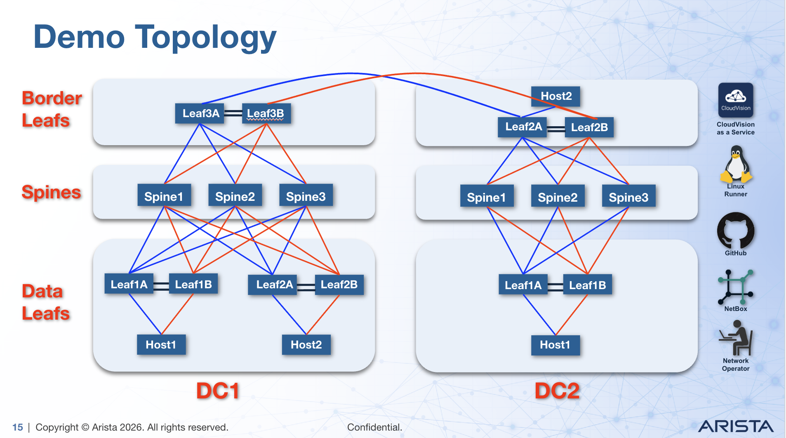

# avdci6: Multi-Datacenter Fabric with AVD 6.x

A demonstration of **Arista Validated Design (AVD) 6.x** applied to a multi-datacenter spine-leaf fabric using the **Modern Operating Model (MOM)** principles. This repository showcases automation, validation, and operational excellence in network infrastructure.

## Table of Contents

- [Introduction](#introduction)
- [What is AVD?](#what-is-avd)
- [Topology Overview](#topology-overview)
- [Project Structure](#project-structure)
- [Quick Start](#quick-start)
  - [Prerequisites](#prerequisites)
  - [Bootstrap Environment](#bootstrap-environment)
  - [Setup Configuration](#setup-configuration)
  - [Virtual Twin with ACT](#virtual-twin-with-act)
- [Workflow Overview](#workflow-overview)
- [Network Design](#network-design)
- [Build, Deploy & Validate](#build-deploy--validate)
- [Configure Hosts](#configure-hosts)
- [Continuous Integration (CI/CD)](#continuous-integration-cicd)
- [Validation](#validation)
- [Modern Operating Model](#modern-operating-model)
- [Troubleshooting](#troubleshooting)
- [References](#references)
- [Glossary](#glossary)

---

## Introduction

**avdci6** demonstrates how to automate network fabric deployment using **Arista Validated Design (AVD) 6.x** in a multi-datacenter environment. The project implements the **Modern Operating Model**, emphasizing:

- **Infrastructure as Code (IaC)** — Network configuration defined in YAML
- **Continuous Integration (CI)** — Automated testing and validation before deployment
- **Repeatability** — Consistent fabric deployments across environments
- **Scalability** — Simple patterns for adding devices (leafs, spines, hosts)
- **Operational Efficiency** — Day-0, Day-1, and Day-2 operations automation

The repository uses **Arista Cloud Test (ACT)** to simulate production topology in a virtual environment, enabling safe testing and iteration before physical deployment.

---

## What is AVD?

**Arista Validated Design (AVD)** is an Ansible collection of roles and playbooks that automate the design, build, and deployment of standardized Arista EOS fabric topologies. AVD 6.x includes:

- **eos_designs** — Data model for fabric intent (spines, leafs, overlay, underlay)
- **eos_cli_config_gen** — Generate EOS configuration from design intent
- **eos_config_deploy** — Deploy configurations to CloudVision Portal
- **eos_validate_state** — Validate fabric state with ANTA tests

**Key Benefits:**
- Eliminates manual configuration — Define intent, not commands
- Consistent topologies across DCs and regions
- Easy scaling — Add devices through YAML changes
- Built-in testing — Validation before deployment
- Compliance & compliance tracking via CloudVision

---

## Topology Overview

This repository defines a **2-datacenter fabric** with high-availability pairs of spine and leaf switches. Each datacenter operates independently but can interconnect for disaster recovery or resource sharing.

### Architecture



### Node Inventory

| Role | Node | DC1 | DC2 |
|------|------|-----|-----|
| **Spine** | SPINE1 | ✓ | ✓ |
| | SPINE2 | ✓ | ✓ |
| | SPINE3 | ✓ | ✓ |
| **Leaf (Data)** | LEAF1A, LEAF1B | ✓ | ✓ |
| **Leaf (Access)** | LEAF2A, LEAF2B | ✓ | ✓ |
| **Host** | HOST1 | ✓ | ✓ |
| | HOST2 | ✓ | ✓ |

**Topology Design Goals:**
- Standardized patterns across datacenters
- No "snowflake" devices — all leafs follow the same configuration pattern
- eBGP for underlay and overlay routing
- VXLAN with EVPN for multi-site connectivity
- MLAG for high availability on leaf pairs

See [Topology Diagram](digital_twin/avdci6.png) for visual reference.

---

## Project Structure

```
avdci6/
├── Makefile                          # Bootstrap and build automation
├── requirements.txt                  # Python dependencies
├── collections.yml                   # Ansible collection versions
├── scripts/
│   ├── setup-venv.sh                # Create Python venv and install deps
│   └── setup-wizard.py               # Interactive inventory configuration
├── digital_twin/
│   ├── avdci6.yml                   # ACT topology file (virtual lab)
│   ├── avdci6.png                   # Topology diagram
│   └── Arista Cloud Test User Guide # ACT documentation
├── avd_project/
│   ├── inventory/
│   │   ├── inventory.yml            # Ansible inventory (hosts and groups)
│   │   └── group_vars/              # Host/group-level variables
│   │       ├── FABRIC/              # Fabric-wide settings
│   │       ├── DC1/                 # DC1-specific settings
│   │       ├── DC2/                 # DC2-specific settings
│   │       ├── DC1_SPINES/          # Spine configuration
│   │       ├── DC1_LEAVES/          # Leaf configuration
│   │       ├── CONNECTED_ENDPOINTS/ # Host configuration
│   │       └── NETWORK_SERVICES/    # VRF and VLAN definitions
│   └── playbooks/
│       ├── build.yml                # Generate fabric configurations (AVD)
│       ├── deploy.yml               # Deploy fabric to CloudVision
│       ├── validate.yml             # Run ANTA validation tests
│       ├── host-build.yml           # Generate host endpoint configs
│       ├── host-deploy.yml          # Deploy host configs to CloudVision
│       └── templates/
│           └── host.j2              # Jinja2 template for host configs
└── README.md                         # This file
```

---

## Quick Start

### Prerequisites

- **macOS or Linux** (development tested on macOS)
- **Python 3.8+** (`python3 --version`)
- **make** (`make --version`)
- **Git** for version control
- **Ansible, Ansible collections** (installed via `make step1-setup`)

Optional:
- **Arista Cloud Test (ACT)** account for virtual lab (https://ce.act.arista.com/)
- **CloudVision Portal** instance (on-premises or CVaaS) for deployment
- **AVD-tooling server** for CI/CD automation and GitHub Actions runner

### Bootstrap (Step 1)

Initialize your entire environment (local and remote) with a single command:

```bash
make step1-setup
```

This target orchestrates:
1. **Local Setup**
   - Creates a Python virtual environment (`.venv/`)
   - Installs Python dependencies from `requirements.txt`
   - Installs Ansible collections from `collections.yml` (arista.avd, arista.eos, etc.)
   - Runs an interactive setup wizard to configure your inventory
   - Validates the Ansible installation

2. **Remote Setup** (if AVD-tooling server in inventory)
   - Bootstraps Ubuntu with Python, Ansible, AVD 6.3+, all required dependencies
   - Registers GitHub Actions runner for CI/CD
   - Creates systemd service for auto-startup on server reboot

**Expected output:**
```
✓ Step 1 complete: Full bootstrap done!
```

After Step 1, your environment is ready. Proceed to Step 2 for the AVD workflow.

### Setup Configuration

The setup wizard prompts for critical infrastructure IPs:

- **CloudVision Portal IP** — Where configurations are deployed and monitored
- **AVD Tooling Server IP** — Optional remote server for automation execution

These values are written to `avd_project/inventory/inventory.yml`.

**Customizing Bootstrap for Remote Server:**

If you have an AVD-tooling server in your Ansible inventory, `step1-setup` will automatically provision it. Customize with parameters:

```bash
make step1-setup \
  LIMIT=avd-tooling-server \
  AVD_USER=ansible \
  AVD_WORKSPACE=/opt/avdci6 \
  RUNNER_TOKEN=$(cat ~/RUNNER_TOKEN)
```

**What gets configured on remote server:**
- ✓ Python 3.10 with virtual environment
- ✓ Ansible 2.14+ with AVD 6.3+ collections
- ✓ Passwordless sudo for automation user
- ✓ Shell profile with venv auto-activation
- ✓ GitHub Actions runner (systemd service)
- ✓ Auto-startup on server reboot

**Running components separately:**

If you need to run setup steps individually:

```bash
# Local setup only
make setup setup-wizard

# Remote server only
make bootstrap-avd-server LIMIT=avd-tooling-server
make setup-github-runner LIMIT=avd-tooling-server
```

**Verify after bootstrap completes:**

SSH into the server and run:
```bash
source .activate
ansible --version
ansible-galaxy collection list | grep arista
systemctl status github-runner
```

### Virtual Twin with ACT

**Arista Cloud Test** creates a virtual simulation of your physical network, enabling safe testing and iteration.

#### 1. Upload ACT Topology File

The topology is defined in [`digital_twin/avdci6.yml`](digital_twin/avdci6.yml):

1. Log in to ACT: https://ce.act.arista.com/
2. Navigate to **Topologies** → **Add Topology**
3. Upload `digital_twin/avdci6.yml`
4. Validate and save

#### 2. Create Development & Production Labs

1. Go to **Labs** → **Add Lab**
2. Name: `avdci6-dev` | Topology: `avdci6`
3. Repeat for `avdci6-prod`
4. Click **Deploy** on each lab (⏱️ 10–20 minutes)

#### 3. Retrieve Lab IPs

Once labs are **Running**:

1. Click on the lab
2. Copy the IP addresses of `cvp`, `avd` hosts
3. Update `avd_project/inventory/inventory.yml` with these IPs
4. Or use: `make setup-wizard` to update interactively

---

## Workflow Overview

The avdci6 project uses a **three-step make-based workflow**:

### **Step 1: Bootstrap** (`make step1-setup`)
One-time setup that configures:
- Your local development machine (Python venv, Ansible, AVD collections)
- Your remote AVD-tooling server (if in inventory) with AVD and GitHub Actions runner

**When:** Run once after cloning the repo.

### **Step 2: Fabric Operations** (`make step2-avd`)
Repeatable workflow for building, deploying, and validating fabric:
- **Build** — Generate device configurations from intent (YAML)
- **Deploy** — Push configs to CloudVision Portal
- **Validate** — Run ANTA tests to verify fabric state

**When:** Run every time you make changes to the fabric network intent.

### **Step 3: Configure Hosts** (`make step3-hosts`)
Repeatable workflow for generating and deploying host endpoint configurations:
- **Host Build** — Generate host endpoint configs from Jinja2 template
- **Host Deploy** — Push host configs to CloudVision Portal using cv_deploy

**When:** Run to configure server/host endpoints connected to the fabric.

## Network Design

### Underlay Routing

- **Protocol:** eBGP (RFC 4271)
- **Spine ASNs:** 65000–65002 (one per spine)
- **Leaf ASNs:** 65100–65103 (grouped per datacenter)
- **Loopback IPs:** Allocated from 10.10.0.0/24 (spines) and 10.10.1.0/24 (leafs)
- **P2P Links:** 10.20.0.0/24 (auto-allocated by AVD)

### Overlay Routing

- **Protocol:** eBGP (EVPN Address Family) — RFC 7432
- **VXLAN:** Encapsulation for tenant traffic
- **Multi-homing:** All leafs active via MLAG
- **Redundancy:** Full mesh BGP peering between leafs and spines

### Data Plane

- **VLAN-based:** Tenant isolation via VLAN
- **MTU:** 1500 (vEOS-lab compatibility)
- **BFD:** Enabled for fast failure detection (300ms holdtime)
- **Spanning Tree:** Disabled (fabric uses BGP for all paths)

**For full design details, see:**
- [AVD 6.3 Leaf-Spine Design](https://avd.arista.com/6.3/ansible_collections/arista/avd/roles/eos_designs/index.html#layer-3-leaf-spine-with-vxlan-evpn)

---

## Build, Deploy & Validate

### Step 2: Full Fabric Workflow

Run the complete build, deploy, and validate workflow with a single command:

```bash
make step2-avd
```

This orchestrates:
1. **Build** — Generate fabric configurations using AVD eos_designs and eos_cli_config_gen
2. **Deploy** — Push to CloudVision Portal
3. **Validate** — Run ANTA tests

### Individual Fabric Commands

If you prefer to run steps separately:

#### Generate Fabric Configuration

```bash
make build
```

AVD reads your intent files and generates EOS configurations:

**Outputs:**
- `avd_project/AVD-information/configs/` — Final EOS commands per device
- `avd_project/AVD-information/documentation/` — Network topology and IP allocation reports
- `avd_project/AVD-information/structured_configs/` — Intermediate YAML (for CI tools)

#### Deploy Fabric to CloudVision

```bash
make deploy
```

Pushes generated fabric configurations to your CloudVision instance using cv_deploy role. CloudVision stages change controls. Review and approve in the WebUI before devices are configured.

#### Validate Fabric State

```bash
make validate
```

Runs ANTA tests to verify actual device state matches design. Reports are written to `avd_project/AVD-information/reports/`.

---

## Configure Hosts

### Step 3: Host Endpoint Configuration

Run the complete host configuration and deployment workflow:

```bash
make step3-hosts
```

This orchestrates:
1. **Host Build** — Generate host endpoint configurations from Jinja2 template
2. **Host Deploy** — Push host configs to CloudVision Portal

### Host Configuration Design

Host configurations are generated using a Jinja2 template with the following topology:

**L2 Trunk Connectivity:**
- Each host has 2 L2 trunk ports connecting to the datacenter leaf pairs
- All trunks carry VLANs 10-50 for multi-tenant isolation

**VLAN SVI Configuration:**
- **VLANs:** 10, 20, 30, 40, 50
- **IP Addressing Pattern:** `<VLAN>.0.<DC>.<Host>/23`
  - Example: DC1-HOST1 VLAN10 = `10.0.1.1/23`
  - Example: DC2-HOST2 VLAN20 = `20.0.2.2/23`

**Host Topology Map:**
| Host | Leaf Uplinks | VRF | Management |
|------|--------------|-----|------------|
| DC1-HOST1 | DC1-LEAF1A, DC1-LEAF1B | Default | 192.168.0.30/24 |
| DC1-HOST2 | DC1-LEAF2A, DC1-LEAF2B | Default | 192.168.0.31/24 |
| DC2-HOST1 | DC2-LEAF1A, DC2-LEAF1B | Default | 192.168.0.32/24 |
| DC2-HOST2 | DC2-LEAF2A, DC2-LEAF2B | Default | 192.168.0.33/24 |

### Individual Host Commands

If you prefer to run steps separately:

#### Generate Host Configurations

```bash
make host-build
```

Generates host endpoint configurations from the Jinja2 template (`playbooks/templates/host.j2`):

**Outputs:**
- `avd_project/AVD-information/configs/DC1-HOST1.cfg`
- `avd_project/AVD-information/configs/DC1-HOST2.cfg`
- `avd_project/AVD-information/configs/DC2-HOST1.cfg`
- `avd_project/AVD-information/configs/DC2-HOST2.cfg`

#### Deploy Host Configurations

```bash
make host-deploy
```

Deploys host configurations to CloudVision Portal using cv_deploy role. Configuration is read from `~/DEV_AVDCI6_TOKEN` (local token file).

**Note:** Unlike fabric deployment, host configurations use `cv_run_change_control: false` for faster orchestration.

---

## Continuous Integration (CI/CD)

The repository includes GitHub Actions workflows that automate linting, building, deploying, and validating configurations on every push to non-main branches.

### Setup Overview

The complete setup is a single command that configures both local and remote environments:

```bash
make step1-setup
```

This orchestrates:
- ✓ Local: Python venv, Ansible, AVD, project configuration
- ✓ Remote: AVD-tooling server provisioning (if in inventory)
- ✓ Remote: GitHub Actions runner setup and registration

### GitHub Actions Runner Configuration

#### 1. Generate GitHub Personal Access Token (PAT)

1. Go to GitHub → Settings → Developer settings → Personal access tokens
2. Click **Generate new token (classic)**
3. Name: `avdci6-runner`
4. Scopes: Check `repo` and `admin:repo_hook`
5. Click **Generate token**
6. Copy the token immediately (you won't see it again)

#### 2. Save Token Locally

On your development machine, save the token:

```bash
echo "YOUR_TOKEN_HERE" > ~/RUNNER_TOKEN
chmod 600 ~/RUNNER_TOKEN
```

#### 3. Run Bootstrap

The `step1-setup` target automatically configures the runner as part of full bootstrap:

```bash
make step1-setup
```

This includes runner setup which will:
- Download the GitHub Actions runner (v2.336.0)
- Register the runner with your GitHub repository
- Create a systemd service for automatic startup
- Configure runner labels: `[self-hosted, Linux, X64, dev]`

#### 4. Verify Runner is Online

1. Go to GitHub → Repository Settings → Actions → Runners
2. You should see your runner status as **Idle** (ready to accept jobs)

### CI/CD Workflow

The workflow defined in `.github/workflows/dev-runner.yml` runs on every push to non-main branches:

**Pipeline Stages:**
1. **Lint** (5 min timeout)
   - Runs `yamllint` on inventory files
   - Runs `ansible-lint` on playbooks
   - Fails fast if configuration is invalid

2. **Build** (15 min timeout)
   - Runs `make build` to generate configurations
   - Verifies output directory contains device configs
   - Commits generated configs back to branch if changed

3. **Deploy** (10 min timeout)
   - Runs `make deploy` to push configs to CloudVision
   - Waits 30 seconds for CloudVision to process changes

4. **Validate** (15 min timeout)
   - Runs `make validate` to execute ANTA tests
   - Uploads test reports as artifacts
   - Displays validation summary in GitHub

### Testing Your Workflow

Push a test branch to trigger the workflow:

```bash
git checkout -b test/my-config
# Make a config change
git add avd_project/
git commit -m "test: sample config change"
git push origin test/my-config
```

Then monitor progress:
1. Go to GitHub → Actions
2. Click your workflow run
3. View step-by-step logs

### Runner Management

**View runner logs:**
```bash
# SSH into AVD-tooling server
ssh ansible@<avd-tooling-ip>

# View service status
systemctl status github-runner

# Tail logs
journalctl -u github-runner -f

# Restart runner if needed
systemctl restart github-runner
```

**Unregister runner (cleanup):**
```bash
cd ~/actions-runner
./config.sh remove --token <removal-token>
```

---

## Validation

### Manual Device Checks

SSH into any device and verify:

```bash
# Check BGP peer status (underlay)
show bgp ipv4 summary

# Check BGP EVPN status (overlay)
show bgp evpn summary

# Verify VXLAN tunnel state
show vxlan tunnel

# Inspect MLAG pairs
show mlag status

# View system readiness
show system status

# Check NTP synchronization (critical for BGP)
show ntp status
```

### Automated Validation (ANTA)

The repository includes ANTA tests that validate:

- All BGP peers are up (underlay and overlay)
- VXLAN tunnels are operational
- MLAG is synchronized
- NTP is synced (critical for BGP timers)
- Configuration is committed (no uncommitted changes)

Run validation:

```bash
make syntax       # Check playbook syntax
make lint         # Run ansible-lint on playbooks
```

---

## Modern Operating Model

The **Modern Operating Model** separates network operations into three phases:

### **Day 0: Bootstrap**
*One-time setup — What you're doing now.*

- Deploy fabric with baseline configuration
- Onboard devices to CloudVision
- Enable automation tooling (Ansible, Git)
- Validate fabric state

### **Day 1: Fabric Operations**
*Ongoing scaling — Add/remove devices.*

Examples:
- **Add a new spine:** Update `group_vars/DC1_SPINES/spines.yml` with new spine definition
- **Add a new leaf pair:** Update `group_vars/DC1_LEAVES/l3_leaves.yml` with leaf node group
- **Onboard new host:** Update `CONNECTED_ENDPOINTS` group_vars

Workflow:
1. Update inventory YAML with new device intent
2. Run `ansible-playbook playbooks/build.yml` to generate new configs
3. Validate in ACT before production
4. Run `ansible-playbook playbooks/deploy.yml` to push to CloudVision
5. CloudVision stages and operator approves changes

### **Day 2: Tenant Operations**
*Application lifecycle — Manage networks, VLANs, users.*

Examples:
- **Add a new tenant:** Create new VRF + VLAN in `NETWORK_SERVICES` group_vars
- **Provision server port:** Add host interface definition
- **Change QoS policy:** Update per-interface or per-VLAN policy

Tenant changes are versioned in Git and tracked through the CI pipeline.

---

## Troubleshooting

### Common Issues

#### "ansible: command not found"
Ensure you've activated the venv:
```bash
source .venv/bin/activate
```

#### "Collection arista.avd does not support Ansible version X.Y.Z"
This is a warning. Collections are forward-compatible. Verify collection installation:
```bash
ansible-galaxy collection list | grep arista
```

#### "CloudVision IP unreachable"
1. Verify IP in `inventory.yml` matches your lab
2. Ensure CloudVision is deployed and running
3. Check network connectivity: `ping <cvp-ip>`
4. Verify credentials in inventory

#### AVD build fails with "Undefined variable"
1. Check the variable name in the error message
2. Verify it's defined in the appropriate `group_vars/` file
3. Check YAML indentation (common source of undefined variables)

#### YAML syntax error
Run a linter to catch formatting issues:
```bash
yamllint avd_project/inventory/group_vars/
```

**Debug:** Add verbose output to playbooks:
```bash
ansible-playbook -vvv playbooks/build.yml
```

---

## References

### Arista Documentation
- [AVD 6.3 Overview](https://avd.arista.com/6.3/index.html)
- [eos_designs Role Documentation](https://avd.arista.com/6.3/ansible_collections/arista/avd/roles/eos_designs/index.html)
- [Leaf-Spine Design & Examples](https://avd.arista.com/6.3/ansible_collections/arista/avd/roles/eos_designs/index.html#layer-3-leaf-spine-with-vxlan-evpn)
- [Arista Cloud Test (ACT) Guide](https://www.arista.com/en/solutions/cloud-test)
- [Arista Network Testing Automation (ANTA)](https://www.arista.com/en/products/anta)

### Ansible & DevOps
- [Ansible Documentation](https://docs.ansible.com/)
- [Ansible Network Guide](https://docs.ansible.com/ansible/latest/network/index.html)
- [Ansible Collections](https://docs.ansible.com/ansible/latest/collections/index.html)

### Network Standards
- [RFC 7432 — BGP EVPN](https://tools.ietf.org/html/rfc7432)
- [RFC 8365 — VXLAN with EVPN Control Plane](https://tools.ietf.org/html/rfc8365)
- [RFC 4271 — BGP](https://tools.ietf.org/html/rfc4271)

---

## Glossary

| Term | Abbreviation | Definition |
|------|:--:|-----------|
| Arista Cloud Test | **ACT** | Cloud-based virtual lab using production EOS and CVP images for safe testing |
| Arista Validated Design | **AVD** | Ansible collection automating fabric design, build, and deployment |
| Continuous Integration | **CI** | Automated testing and validation pipeline before production deployment |
| CloudVision Portal | **CVP** | Arista's network management, configuration, and compliance platform |
| Extensible Operating System | **EOS** | Arista's Linux-based network operating system |
| Border Gateway Protocol | **BGP** | Dynamic routing protocol for underlay and overlay routing |
| Ethernet VPN | **EVPN** | Overlay routing protocol for VXLAN multi-site connectivity (RFC 7432) |
| Multi-Chassis Link Aggregation | **MLAG** | High-availability peering between two leaf switches for active-active redundancy |
| Network Testing & Automation | **ANTA** | Arista's framework for validating network state and compliance |
| Virtual Extensible LAN | **VXLAN** | Encapsulation protocol for tenant traffic across L3 fabric |
| Infrastructure as Code | **IaC** | Network configuration defined in version-controlled YAML files |
| Modern Operating Model | **MOM** | Arista's operational framework for Day-0, Day-1, Day-2 network automation |
| Source Code Management | **SCM** | Git-based version control (GitHub, GitLab, Bitbucket, etc.) |
| Python Virtual Environment | **venv** | Isolated Python environment for project-specific dependencies |

---

## Getting Help

### Available Make Targets

```bash
make help                    # Show all available targets
make step1-setup             # One-time bootstrap (local + remote server)
make step2-avd               # Full fabric workflow (build → deploy → validate)
make step3-hosts             # Host configuration (host-build → host-deploy)
make build                   # Generate fabric configs only
make deploy                  # Deploy fabric to CloudVision only
make validate                # Run ANTA tests only
make host-build              # Generate host endpoint configs only
make host-deploy             # Deploy host configs to CloudVision only
make syntax                  # Check playbook syntax
make lint                    # Run ansible-lint
```

### Support Resources

- **Issues & Questions:** File a GitHub issue in this repository
- **Documentation:** See [References](#references) section above
- **Arista Support:** Contact your Arista Technical Account Manager (TAM) or [Arista Support Portal](https://www.arista.com/en/support)

---

**Last Updated:** August 12, 2026  
**Version:** 2.0 — Step 3 Host Configuration Added  
**AVD Version:** 6.3+  
**Ansible:** 2.14+  
**Python:** 3.8+
